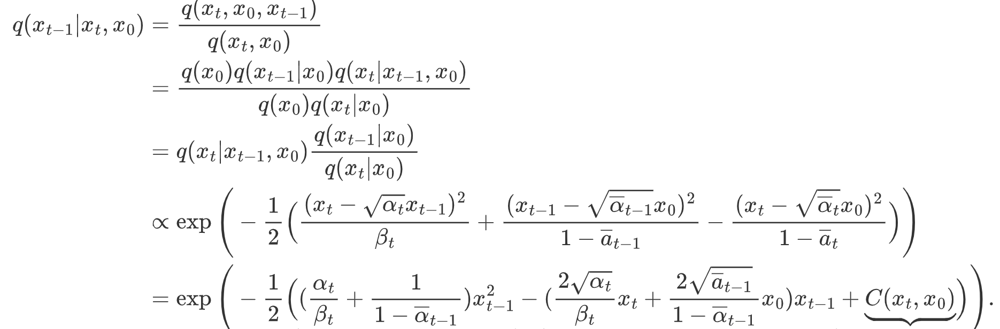

# autoregressive model(自回归模型)
用上一个时刻和之前一些时刻的特征值，来预测下一时刻的特征值。也就是说，每一时刻的预测值都依赖于前几个时刻的数据。
# variance auto encoder(变分自编码器)
## 定义
满足一定概率分布的z，此分布由参数θ来描述-Pθ(z)
high dimensional variable x：此分布是以z为条件的条件概率分布-Pθ(x|z)
想要得到Pθ(x|z)，需要知道z的概率分布，而想要知道z的概率分布，需要一个后验网络，通过x生成z。
## 结构
.png
[链接](https://zhuanlan.zhihu.com/p/34998569)
# diffusion model
## 基于马尔可夫(Markov)链假设的条件概率
马尔科夫链：A->B->C，C的条件概率只与B有关，与A无关。也就是说在此刻发生的事情与上一时刻有关，与更之前的时刻无关。

因此联合概率密度P(A,B,C)=P(C|B,A)*P(B|A)*P(A)=P(C|B)*P(B|A)*P(A)。
## 重参数化
在VAE中latent space的latent variance z~N(μ,σ2)，如果直接对z进行取样，会导致在反向传播时对参数μ、σ的不可导，导致梯度下降无法进行。
因此，应该先设置一个ε~N(0,1)，然后令z=μ+ε*σ，此时相当于ε作为输入z作为输出，那么在反向传播时对参数μ、σ的就可导。
## diffusion model 图示

其中XT至X0属于逆扩散过程，X0至XT属于扩散过程。
扩散过程就是加噪过程，最后生成高斯噪音。而逆扩散过程就是去噪过程，最后生成图片。
### 扩散过程

**xt是图片数据，而q(xt|xt-1)是正态分布，xt是从正态分布q(xt|xt-1)中采样得到的。**

从上一个时刻预测下一个时刻，是条件概率分布，此条件概率分布满足正态分布，如上图所示。且均值和方差只由上一时刻的概率分布和固定参数βt决定，没有需要训练的参数。

又因为扩散过程是一个马尔科夫链，所以联合分布就是条件分布的乘积。

**由上图公式所示**：在xt-1加噪至xt过程中，噪声的方差是由βt来确定的，噪声的均值是由βt和xt-1确定的。每一时刻的βt是固定的，随着时刻向后延伸，βt越来越大，此时下一时刻的概率分布越趋近于标准正态分布。

#### 扩散过程中的重参数化
因为xt是从正态分布q(xt|xt-1)中采样得到的，那么在反向传播时，对q(xt|xt-1)直接采样导致，对其正态分布中的均值和方差不可导，导致梯度下降中断，因此采用重整化，先从标准正态分布中采样，再用均值和方差计算出xt，保证可导。

上图便是重参数化，z都是从标准正态分布的采样。又根据独立正态分布的可加性，可知xt可由x0和参数αt、αt-1、...、α1直接确定。

其中第五步就是训练让下一时刻的概率分布越来越趋近于标准正态分布。

### 逆扩散过程

此时xt-1也是服从正态分布的，均值和方差都由xt和t决定。计算均值和方差需要各自训练一个神经网络来拟合。
由于均值和方差未知，显然p(xt-1|xt)不能通过xt直接得出，q(xt-1|xt,x0)可以由xt,x0直接得出。

上面两个公式算出方差和均值，其中均值中的x0可以用xt表示。
最终可算得只用xt表示的均值

zt是t时刻扩散过程时所加噪声，该噪声服从标准正态分布。这一时刻噪声的获取是利用了扩散过程时训练的神经网络：输入t时刻的xt，输出t时刻所加的噪声zt。

其中第四步就是重参数化，先通过扩散过程训练的神经网络：输入t时刻的xt，输出t时刻所加的噪声。然后得出p(xt-1|xt)的均值，前面算出的方差是常数，这样一来，均值和方差已知，就可以重参数化，从标准正态分布中采样出z，最后得出xt-1